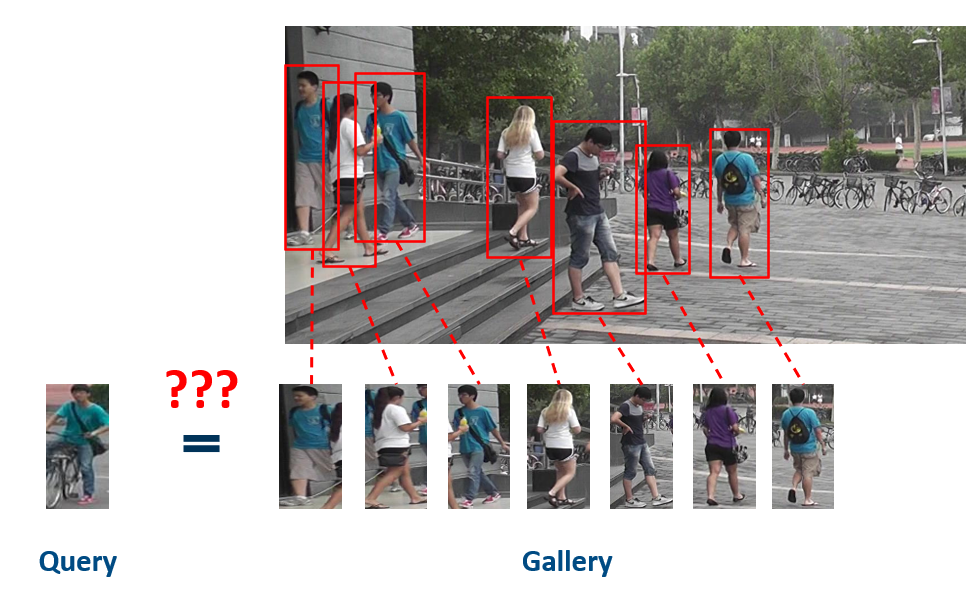
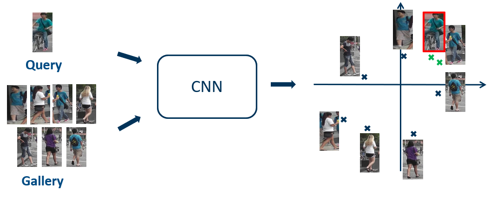
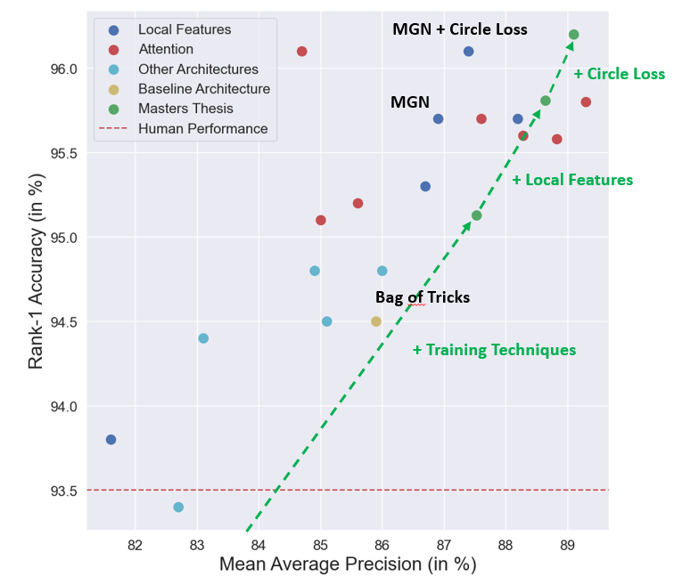

Codebase used for my masters thesis "Lernen von Merkmalen für die erscheinungsbasierte Personenwiedererkennung durch
Einsatz moderner Fehlerfunktionen für tiefe neuronale Netzwerke"

## Person Re-Identification

The goal of person re-identification is to find a person of interest (Query) in a collection of images of different 
people (Gallery).



To solve this problem modern systems usually rely on Convolutional Neural Networks (CNNs) that were trained to map
similar images to similar feature vectors. The best match in the gallery can then be determined by just comparing the 
distances between the feature vector of the query and all feature vectors of the gallery.



## Results

The best model combines approaches of the following publications:

- Bag of Tricks and A Strong Baseline for Deep Person Re-identification (https://arxiv.org/pdf/1903.07071)
- Learning Discriminative Features with Multiple Granularities for Person Re-Identification (https://arxiv.org/pdf/1804.01438)
- Circle Loss: A Unified Perspective of Pair Similarity Optimization (https://arxiv.org/pdf/2002.10857)

The following graphic compares the results of this implementation with the State of the Art in the domain of 
Person Re-Identification (state: 20.01.2021)




## Setup

1. Clone repository: 
    ````
    git clone https://github.com/Joachim93/person_reidentification.git
    ````
   
2. Install dependecies:
    ````
    conda env create --file environment.yml
    ````
   
3. Data Preparation

    Four different often used datasets are currently supported for this codebase: Market1501,
    DukeMTMC, CUHK03 and MSMT17. All datasets can be used separated or combined. To transform the data to the expected format
    for training, run the following script.
    ````
    python data/create_datasets.py \
        --input_dirs {path(s)} \
        --dataset_names {name(s)} \
        --output_dir {path} \
        --validation_dir {path} \
        --split_ratio {float}   
    ```` 
    The following script transforms the data into a certain format, which is expected for training the model.
    If more than one argument is passed to ``--input_dirs`` and ``--dataset_names``, multiple datasets are combined into 
    one. Please note that each path should match the corresponding dataset name (order is important).
     ``--validation_dir`` and ``--split_ratio`` are optional to split a part of training data into validation data.
   
4. Set path to pretrained weights

    To use the pytorch version of Resnet50 (which ist recommended) you need to load weights, which 
    where manually extracted and saved at `\results_nas\jowa3080\resnet_pytorch.npy`. You can copy 
    these weights to the desired destination and have to change the path at the begin of
    `model/resnet_pytorch.py` accordingly.

## Usage
This repository contains scripts, that can be used to train and test several 
model architectures and configurations in context of person re-identification.
There are three main scripts, which are executable with different parameters.

-   `train.py`:
    -   main script for training a neural network
    -   arguments that can be specified are defined in `parameters.py` with a little 
        description for each of them
        
-   `test_checkpoint.py`:
    -   script for evaluation of a single checkpoint of a trained model
    -   can be used to evaluate a given checkpoint of a model with another dataset,
        distance metric, etc.
    
-   `test_checkpoint.py`:
    -   script for evaluation of a single checkpoint of a trained model
    -   can be used to evaluate all checkpoints of a configuration with another dataset,
        distance metric, etc.
        
## Training
Below ist a selection of parameters to reproduce the best models discovered during
experiments.

### Baseline
Hint for all configurations: The expected path for `--dataset_dir` is the one specified in `--ouput_dir` in step 3 
of the installation process. The expected path for `--test_data_dir` is the one, where the original data is located.

To get good results with Circle Loss it is recommended to pretrain a model with Softmax Loss and Triplet Loss. All
arguments that are not defined here use the default settings specified in ``parameters.py``.
````
python train.py \
    --output_dir {path} \
    --dataset_dir {path} \ 
    --test_data_dir {path}     
````
After that take the pretrained weights and fine tune with circle loss.
````
python train.py \
    --output_dir {path} \
    --dataset_dir {path} \ 
    --test_data_dir {path} \
    --pretrain_weights {path} \
    --number_instances 8 \    
    --classification_loss circle \
    --metric_loss none \
    --classification_loss_scale 64 \
    --classification_loss_margin 0.25 \  
    --epochs 40 \   
    --start_learning_rate 3.5e-5 \
    --learning_rate_steps 10 \
    --warmup_epochs 0
````

### Multiple Granularity Network (MGN)
Pretrain with Softmax and Triplet Loss.
````
python train.py \
    --output_dir {path} \
    --dataset_dir {path} \ 
    --test_data_dir {path} \  
    --input_size 384 128 \
    --architecture mgn \ 
    --global_pooling max \
    --triplet_margin_value 1.2 \ 
    --epochs 140 \
    --learning_rate_steps 60 90 \
    --freeze_epochs 20 
````
The best model with MGN architecture was finetuned with AAML.
````
python train.py \
    --output_dir {path} \
    --dataset_dir {path} \ 
    --test_data_dir {path} \  
    --input_size 384 128 \
    --number_instances 8 \
    --architecture mgn \ 
    --global_pooling max \ 
    --last_stride \
    --classification_loss aaml \
    --classification_loss_scale 32 \
    --classification_loss_margin 0.5 \
    --metric_loss none \ 
    --epochs 40 \
    --start_learning_rate 3.5e-5 \
    --learning_rate_steps 10 \
    --warmup_epochs 0 
````


To push the result even further test time augmentation can be used with the 
argument `--test_time_aug` for every model during inference. For all configurations gradient checkpointing
is activated by default. On machines with much GPU memory it is possible to deactivate
it with `--gradient_checkpointing` to accelerate training.


## Evaluation

Below are the weights of our best models for the different baselines. 


If you want to evaluate one of these checkpoints make sure to save the weights and settings file
in the following structure. The settings file is needed to build the correct architecture.
````
|-- settings.json
|-- weights
    |-- checkpoint.h5
````

To evaluate a trained model on a given dataset use the following call.
````
python test_checkpoint.py \
    --configuration {path} \
    --test_data_dir {path} \      
````


