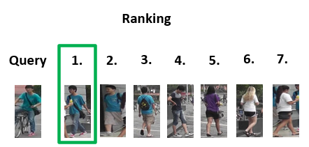
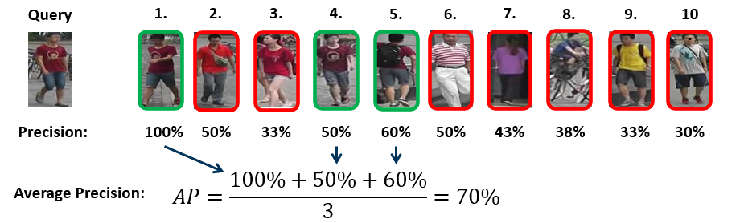

# 🔍 Person Re-Identification with Deep Learning

This project was developed as part of my master's thesis and focuses on automatic person re-identification. The objective was to significantly enhance an existing solution by analyzing and integrating state-of-the-art approaches.

**Achievements:**

- Establishment of a **comprehensive knowledge base** through the systematic evaluation of architectural designs, loss functions, training strategies, and their complex interactions.

- Development of a **modular toolbox** featuring various extensions that can be selected based on available memory and computation time.

- Outperformance of existing state-of-the-art benchmarks, achieving **96.23% rank-1 accuracy** and **89.11% mAP** on the Market-1501 dataset.


## Problem Definition

Person re-identification is formally defined as locating a specific person of interest (query) within a collection of images containing various individuals (gallery). In this project, the gallery consists of all individuals currently within the camera's field of view, provided they have already been extracted as bounding boxes.

<center>
    
</center>

To address this task, representative features must be extracted from the images. Most modern systems use a trained Convolutional Neural Network (CNN) for this purpose. During inference, the CNN computes feature vectors for all individuals (both query and gallery).

<center>
    
</center>

Subsequently, the gallery's feature vectors are ranked based on their similarity to the query (e.g., using Euclidean distance) to identify the most accurate match.

<center>
    
</center>


## Approach

A ResNet-50 serves as the baseline, trained to minimize cross-entropy loss across person classes. For inference, the final classification layer is removed, utilizing the outputs of the penultimate layer as robust feature representations. This baseline was then gradually improved by the following enhancements:

- [**Bag of Tricks and A Strong Baseline for Deep Person Re-identification**](https://arxiv.org/pdf/1903.07071)
    - Introduces a number of proven training techniques that facilitate the learning of a good feature representation (e.g., data augmentation, label smoothing, learning rate scheduler)
- [**Learning Discriminative Features with Multiple Granularities for Person Re-Identification**](https://arxiv.org/pdf/1804.01438)
    - Introduces a modification of the network architecture with which local feature representations of individual body regions can be learned and combined at the end
- [**Circle Loss: A Unified Perspective of Pair Similarity Optimization**](https://arxiv.org/pdf/2002.10857)
    - Introduces a specialized loss function, which additionally establishes a margin between the different classes and thus facilitates the learning of discriminative features

## Evaluation Metrics

In person re-identification, two primary criteria are used to evaluate model performance:

**Rank-1-Accuracy**
- Indicates how frequently the correct person of interest appears as the top result in the similarity ranking
- While a standard metric, Rank-1 accuracy alone can be insufficient for datasets where a gallery contains multiple positive matches for a single query

**Mean Average Precision (mAP)**
- Average Precision (AP) calculates the average Precision@k for all positive matches of a query in the test data

<center>
    
</center>

- Mean Average Precision then averages the Average Precision across all queries in the test data


## Results

The [Market-1501 dataset](https://www.cv-foundation.org/openaccess/content_iccv_2015/papers/Zheng_Scalable_Person_Re-Identification_ICCV_2015_paper.pdf) was utilized to evaluate and compare the various extensions. An existing internal solution served as the baseline, which was systematically enhanced. Overall, the integrated approach achieved a significant performance boost of **10.23% in Rank-1 accuracy** and **18.81% in mAP**. The improvements are divided between the individual extensions as follows:

<center>

|Model                          |Rank-1-Accuracy    |Mean Average Precision |
|:------------------------------|:-----------------:|:---------------------:|
|Baseline                       |86.00%            |70.30%                |
|+ Training Techniques          |95.13%            |87.53%                |
|+ Local Features               |95.81%            |88.64%                |
|+ Circle Loss                  |96.23%            |89.11%                |

</center>

The following graphic compares the results of this implementation with the State of the Art in the domain of person re-identification. It shows that by strategically combining complementary state-of-the-art approaches, the final model outperforms the leading benchmarks at the time (state: 20.01.2021).

<center>
    
</center>


## Installation & Setup

**Note on Reproducibility:** This repository was developed as part of a research project at the Technical University of Ilmenau. It utilizes specific datasets and pre-trained weights that are not publicly available. Consequently, full reproduction of the results is primarily supported within the university's internal infrastructure. External use may require some adjustments.


1. Clone repository 
    ````
    git clone https://github.com/Joachim93/person_reidentification.git
    ````
   
2. Install dependencies
    ````
    conda env create --file environment.yml
    ````
   
3. Data Preparation

    The codebase currently supports four widely used datasets: Market-1501, DukeMTMC, CUHK03, and MSMT17. These can be used individually or combined. To transform the raw data into the required training format, run:
    ````
    python data/create_datasets.py \
        --input_dirs {path(s)} \
        --dataset_names {name(s)} \
        --output_dir {path} \
        --validation_dir {path} \
        --split_ratio {float}   
    ```` 

    - If multiple arguments are passed to `--input_dirs` and `--dataset_names`, the script merges them. Ensure the order of paths matches the corresponding dataset names.

    - `--validation_dir` and `--split_ratio` are optional parameters to create a validation split from the training data.

4. Pre-trained Weights

    To use the recommended PyTorch version of ResNet-50, you must load weights that were manually extracted.

    - Locate the weights at: `/results_nas/jowa3080/resnet_pytorch.npy` (internal path)

    - Copy these weights to your desired destination
    - Update the path at the beginning of `model/resnet_pytorch.py` accordingly.


## Usage

This repository provides scripts to train and evaluate various model architectures and configurations for person re-identification. The three primary entry points are:

-   `train.py`:
    -   Main script for training a neural network
    -   Arguments that can be specified are defined in `parameters.py` with a little 
        description for each of them
        
-   `test_checkpoint.py`:
    -   Script for evaluation of a single checkpoint of a trained model
    -   Allows to evaluate a given checkpoint of a model against other datasets, distance metric, etc.
    
-   `test_configuration.py`:
    -   Script for evaluation of all checkpoints of a trained model
    -   Allows to evaluate all checkpoints of a model against other datasets, distance metric, etc.


## Training & Reproducibility

Below is a selection of recommended parameters to reproduce the best-performing models from my experiments.

**General Note on Paths:**

- `--dataset_dir`: Use the path specified as `--output_dir` in the data preparation step.

- `--test_data_dir`: Use the path where the original raw dataset is located.

- All arguments not listed below use the default values defined in parameters.py.

### Baseline

For optimal results with Circle Loss or similar advanced loss functions, it is recommended to first pre-train the model using Softmax and Triplet Loss, followed by a fine-tuning stage.

- Pre-training:

    ````
    python train.py \
        --output_dir {path} \
        --dataset_dir {path} \ 
        --test_data_dir {path}     
    ````

- Fine-tuning:

    ````
    python train.py \
        --output_dir {path} \
        --dataset_dir {path} \ 
        --test_data_dir {path} \
        --pretrain_weights {path} \
        --number_instances 8 \    
        --classification_loss circle \
        --metric_loss none \
        --classification_loss_scale 64 \
        --classification_loss_margin 0.25 \  
        --epochs 40 \   
        --start_learning_rate 3.5e-5 \
        --learning_rate_steps 10 \
        --warmup_epochs 0
    ````


### Multiple Granularity Network (MGN)

- Pre-training:
    ````
    python train.py \
        --output_dir {path} \
        --dataset_dir {path} \ 
        --test_data_dir {path} \  
        --input_size 384 128 \
        --architecture mgn \ 
        --global_pooling max \
        --triplet_margin_value 1.2 \ 
        --epochs 140 \
        --learning_rate_steps 60 90 \
        --freeze_epochs 20 
    ````

- Fine-tuning:

    ````
    python train.py \
        --output_dir {path} \
        --dataset_dir {path} \ 
        --test_data_dir {path} \  
        --input_size 384 128 \
        --number_instances 8 \
        --architecture mgn \ 
        --global_pooling max \ 
        --last_stride \
        --classification_loss aaml \
        --classification_loss_scale 32 \
        --classification_loss_margin 0.5 \
        --metric_loss none \ 
        --epochs 40 \
        --start_learning_rate 3.5e-5 \
        --learning_rate_steps 10 \
        --warmup_epochs 0 
    ````

### Performance & Efficiency Trade-offs

- **Test Time Augmentation:** The `--test_time_aug` flag is disabled by default but can be used to further boost recognition rates.

    - **Benefit:** Improved recognition rates (mAP/Rank-1 accuracy).
    - **Drawback:** Doubles prediction time per image.

- **Gradient Checkpointing:** This feature is enabled by default to minimize the needed GPU memory.

    - **Benefit:** Allows training with larger batch sizes or on GPUs with limited memory.
    - **Drawback:** Increases training time. On systems with sufficient GPU memory, you can disable it via `--gradient_checkpointing` to accelerate the training process.


